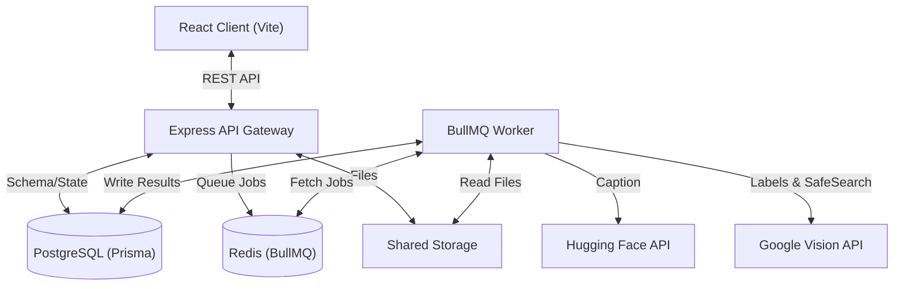

# AMPM: AI-Powered Media Processing Microservice

AMPM is an asynchronous media processing service built on the PERN stack. It offloads heavy AI image processing tasks to a distributed worker pipeline powered by BullMQ and Redis.

---

## System Architecture



### Processing Flow
1. **Ingest**: The client uploads images. The API stores the files locally, writes `pending` database records, enqueues tasks to Redis, and returns Job/Image IDs instantly.
2. **Queue & Execute**: BullMQ workers pull tasks concurrently (default: 3 concurrent jobs).
3. **Pipeline**: For each image, the worker:
   - Generates a caption using Hugging Face's BLIP model.
   - Detects labels using Google Cloud Vision.
   - Runs a Google SafeSearch content audit. Flagged items trigger user alerts.
4. **Retry**: Failed tasks can be retried individually from the user interface.

---

## Tech Stack & Key Decisions

- **Database & ORM**: PostgreSQL with Prisma. Mapped relations for [Users](file:///E:/AMPM/server/prisma/schema.prisma), [Jobs](file:///E:/AMPM/server/prisma/schema.prisma), [Images](file:///E:/AMPM/server/prisma/schema.prisma), and [Notifications](file:///E:/AMPM/server/prisma/schema.prisma).
- **Asynchronous Queue**: BullMQ + Redis for concurrency control, automatic backoff, and retries.
- **Authentication**: Dual support for email/password and Clerk Google OAuth.
  - Exchanges Clerk sessions for custom AMPM JWTs (Access & Refresh tokens).
  - Refresh tokens are rotated on every use and validated against a database `token_version` for instant revocation on logout.
- **API Documentation**: Auto-generated Swagger UI served at `/api-docs`.

---

## Local Development Setup

### Prerequisites
- Docker & Docker Compose installed.

### Environment Setup
1. Copy the template:
   ```bash
   cp .env.example .env
   ```
2. Configure external services in [.env](file:///E:/AMPM/.env.example):
   - **Hugging Face**: Create a read token at [Hugging Face Settings](https://huggingface.co/settings/tokens) (`HUGGINGFACE_API_TOKEN`).
   - **Google Cloud Vision**: Enable the API on Google Cloud Console, generate an API key, and set `GOOGLE_CLOUD_VISION_API_KEY`.
   - **Clerk Google Sign-in**: Set `CLERK_SECRET_KEY` and `VITE_CLERK_PUBLISHABLE_KEY`. Set `http://localhost:5173/sso-callback` as a redirect URL in your Clerk dashboard.

3. Run database migrations:
   ```bash
   docker-compose run --rm server npx prisma migrate deploy
   ```

### Running the Services
Start the entire stack using Docker Compose:
```bash
docker-compose up --build
```
- **React Client**: [http://localhost:5173](http://localhost:5173)
- **API Spec & Gateway**: [http://localhost:3001/api-docs](http://localhost:3001/api-docs)

---

## API Endpoints

| Method | Endpoint | Auth | Description |
|---|---|---|---|
| `POST` | `/api/auth/signup` | No | Registers a new account |
| `POST` | `/api/auth/login` | No | Authenticates credentials and returns JWTs |
| `POST` | `/api/auth/clerk` | No | Exchanges verified Clerk session for AMPM JWTs |
| `POST` | `/api/auth/refresh` | No | Rotates access/refresh token pair |
| `POST` | `/api/auth/logout` | Yes | Revokes refresh tokens globally |
| `GET`  | `/api/auth/me` | Yes | Returns authenticated user details |
| `POST` | `/api/jobs` | Yes | Uploads one or more images (multipart) |
| `GET`  | `/api/jobs` | Yes | Lists user's jobs with derived statuses |
| `GET`  | `/api/jobs/:jobId` | Yes | Returns job metadata and image processing results |
| `POST` | `/api/jobs/:jobId/images/:imageId/retry` | Yes | Re-enqueues a failed image for processing |
| `GET`  | `/api/notifications` | Yes | Lists user alerts and safety warnings |
| `PATCH`| `/api/notifications/:id/read` | Yes | Marks an alert as read |

---

## Job Status Logic

Job status is derived dynamically at runtime from child images:
- `pending`: All images are pending.
- `processing`: At least one image is pending or processing.
- `completed`: All images completed successfully.
- `failed`: All images failed.
- `partially_completed`: All finished, but some succeeded and others failed.

---

## Production Scaling

- **Worker Scaling**: Spin up more worker replicas. BullMQ coordinates atomic task lock distribution.
- **Distributed Storage**: Swap local storage mounts with S3 or Cloudflare R2.
- **Database & Queue**: Delegate Redis and PostgreSQL to managed services (e.g. AWS ElastiCache, Neon).
