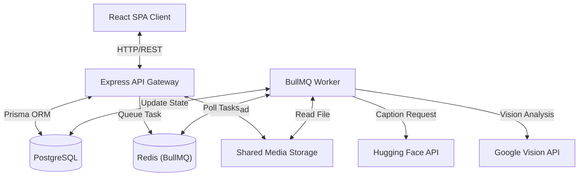
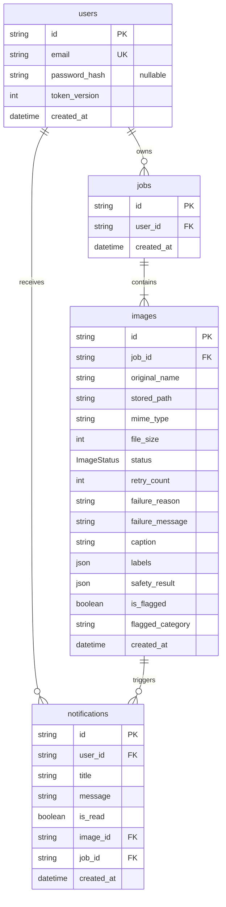
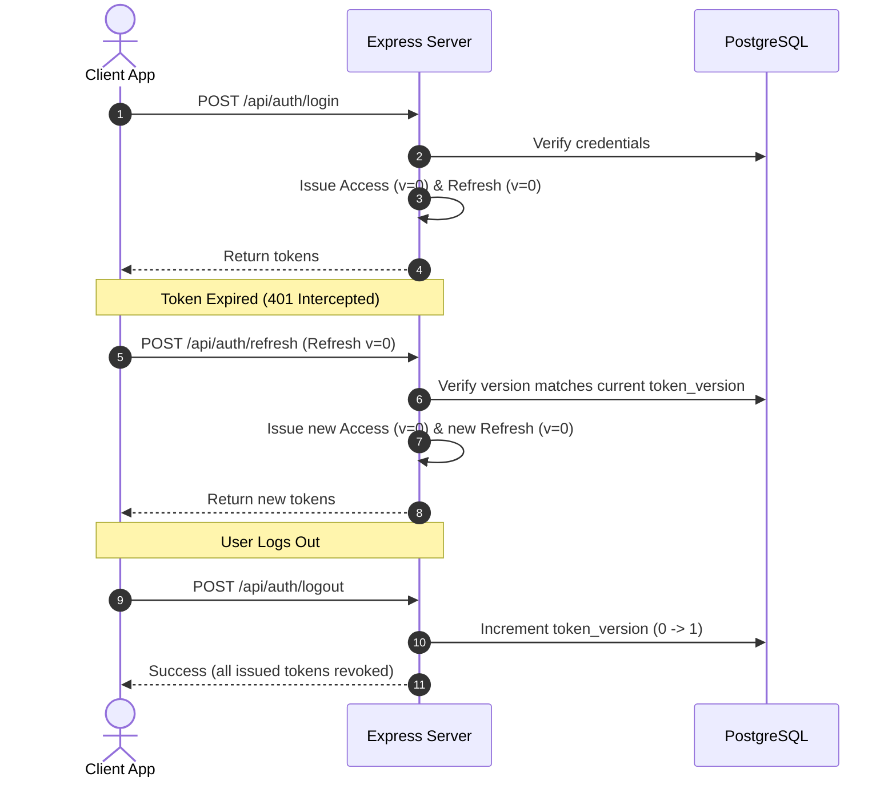
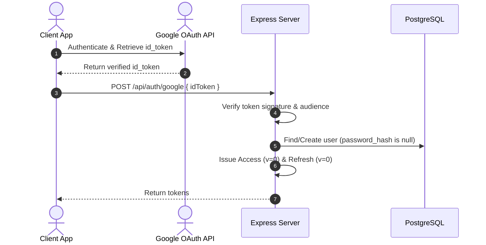

# AMPM: Architecture Documentation

This document defines the architecture of the **AMPM** (AI-Powered Media Processing Microservice).

---

## 1. High-Level Architecture Overview



---

## 2. Directory Layout & Package Breakdown

The codebase consists of three main packages:
- **[/client](file:///E:/AMPM/client)**: React (Vite) single-page application.
- **[/server](file:///E:/AMPM/server)**: Express REST API handling authentication, file storage, job records, and user notifications.
- **[/worker](file:///E:/AMPM/worker)**: Node.js service executing the asynchronous AI image pipeline.

---

## 3. Database Schema Design

The relational schema is managed via Prisma in [schema.prisma](file:///E:/AMPM/server/prisma/schema.prisma).



- **Dynamic Job Status**: Job status is calculated dynamically at runtime by checking the status of its child `Image` records (not stored in the database).
- **Token Versioning**: `token_version` on the `User` model is used to invalidate all active refresh tokens on logout.

---

## 4. Authentication & Security Model

Auth supports local email/password credentials and native Google OAuth (Google Sign-In), backed by a secure access/refresh token model with Refresh Token Rotation (RTR).

### Local Authentication Flow



### Google OAuth Flow



---

## 5. Job Upload & Atomic Enqueueing

When uploading a batch of $N$ images:
1. **Validation**: Multer validates file types (JPEG, PNG, WEBP) and size (limit: 5MB per file).
2. **Transaction**: A database transaction creates a `Job` record and $N$ related `Image` records with `PENDING` status.
3. **Queueing**: Tasks are enqueued to Redis via BullMQ.
4. **Rollback Safety**: If queue insertion fails, the database transaction is rolled back (the job and images are deleted) to avoid orphaned `PENDING` states.

---

## 6. Worker Pipeline

The worker polls BullMQ tasks and runs each image through the following stages:

```mermaid
flowchart TD
    Start([Task Received]) --> Proc[Mark Status: PROCESSING]
    Proc --> Sharp[Read & Validate Image via Sharp]
    
    subgraph AI Pipeline
        Sharp --> Safe[1. Google Vision SafeSearch]
        Safe --> Label[2. Google Vision Labels]
        Label --> Caption[3. Hugging Face Captioning (if safe)]
    end

    Safe --> SafetyCheck{SafeSearch Flagged?}
    SafetyCheck -->|Yes| Flag[Set isFlagged: true & Category]
    Flag --> Notif[Create User Notification in DB]
    Notif --> Save[Save AI Output to DB]
    SafetyCheck -->|No| Save

    Save --> Comp[Mark Status: COMPLETED]
    Comp --> Done([Task Completed])

    AI Pipeline -.->|Pipeline Failure| Err[Categorize Error Retryability]
    Err --> RetryCheck{Retryable?}
    
    RetryCheck -->|No| Fail[Mark Status: FAILED]
    Fail --> Discard[Discard Task]
    Discard --> EndErr([Task Discarded])

    RetryCheck -->|Yes| AttemptCheck{Attempts Remaining?}
    AttemptCheck -->|Yes| Resubmit[Increment retry_count & Set PENDING]
    Resubmit --> FailQueue([Fail Task for Redis Retry])
    
    AttemptCheck -->|No| FinalFail[Mark Status: FAILED with MAX_RETRIES_EXCEEDED]
    FinalFail --> EndErr
```

### Error Classification
- **Non-Retryable Errors** (`INVALID_FILE`, `UNSUPPORTED_FORMAT`, `FILE_TOO_LARGE`): Database status is set to `FAILED` and `job.discard()` is called to stop BullMQ from retrying.
- **Retryable Errors** (`TIMEOUT`, `RATE_LIMIT`, `API_ERROR`, `INTERNAL_ERROR`): Database status is reset to `PENDING`, `retryCount` is incremented, and the task fails, prompting BullMQ to retry with exponential backoff.
