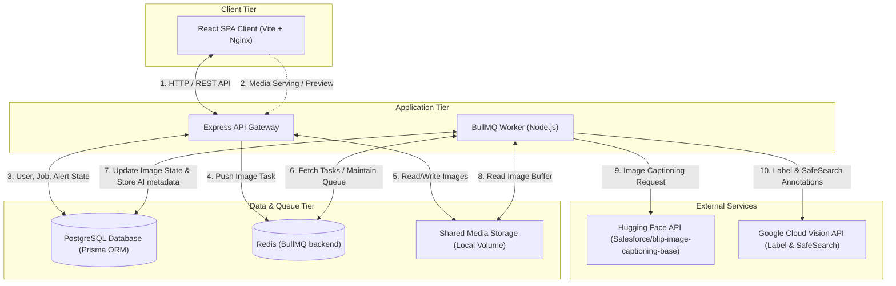
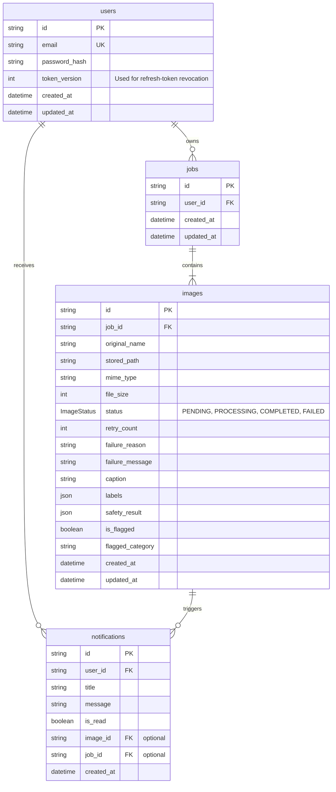
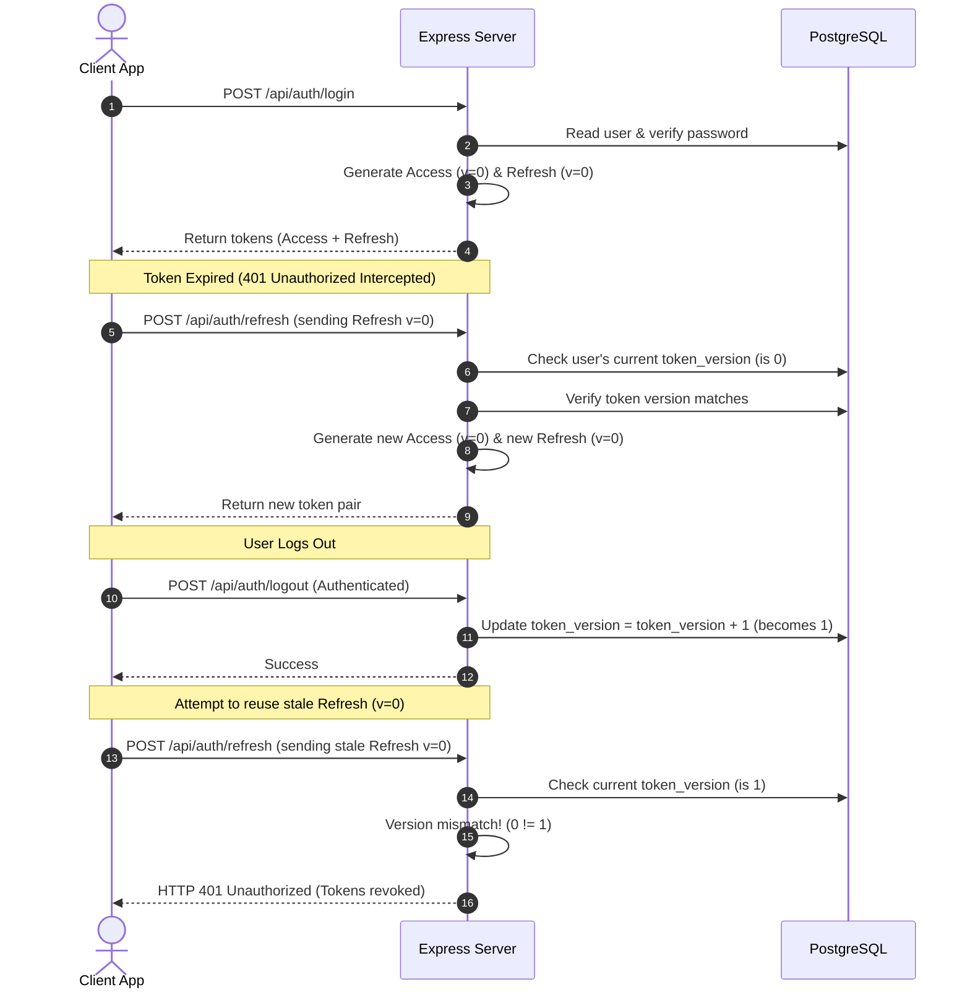
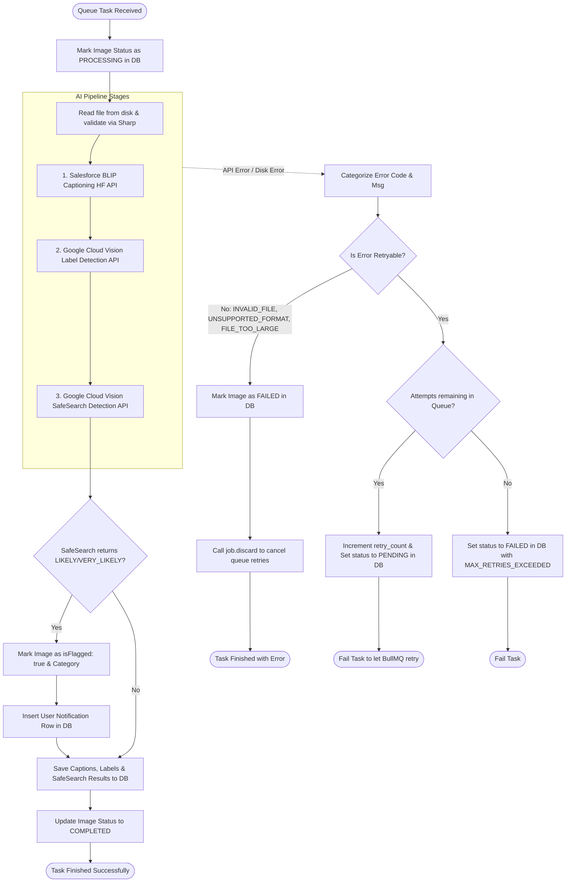

# AMPM: Architecture Documentation

This document describes the architecture of the **AMPM** (AI-Powered Media Processing Microservice) system. It outlines the system components, data models, network flow, security mechanisms, and key design decisions based on an exploration of the codebase.

---

## 1. High-Level Architecture Overview

AMPM is built on a **decoupled producer-consumer microservice architecture** using the PERN (PostgreSQL, Express, React, Node.js) stack. The design ensures that high-latency, resource-heavy image processing is offloaded to asynchronous worker nodes, preventing blocking of the user-facing API gateway.

### Component Diagram



---

## 2. Directory Layout & Package Breakdown

The codebase is split into three main packages at the repository root, operating without a monorepo workspace tool (e.g. npm workspaces).

- **[`/client`](file:///E:/AMPM/client)**: A Vite-configured Single Page React Application served via Nginx in production.
- **[`/server`](file:///E:/AMPM/server)**: An Express REST API that handles auth, job ingestion, file storage, and serves metadata.
- **[`/worker`](file:///E:/AMPM/worker)**: A dedicated Node.js service that runs the asynchronous processing pipeline on queued images.
- **`docker-compose.yml`**: Configures local development and production-like execution with PostgreSQL, Redis, API Server, Worker, and Client.

---

## 3. Database Schema Design

The relational database is PostgreSQL, mapped using the Prisma ORM ([`server/prisma/schema.prisma`](file:///E:/AMPM/server/prisma/schema.prisma)).



### Models & Key Relations:
1. **`User`**: Stored credentials, auditing dates, and a `tokenVersion` counter to track JWT refresh token validity.
2. **`Job`**: Acts as a logical batch container for image operations.
   > [!IMPORTANT]
   > The **Job status is not stored in the database**. It is calculated dynamically at runtime from its constituent `Image` records' statuses (see Section 6).
3. **`Image`**: Stores image metadata, the physical file path, the current pipeline stage (`ImageStatus`), retry counts, error classification if failed, and output fields populated by the AI APIs.
4. **`Notification`**: Standard in-app notification system mapping system events (like flagged content) back to the user.

---

## 4. Authentication and Security Model

The system utilizes an asynchronous token-based authentication scheme with strict defense-in-depth measures.

### JWT Access & Refresh Lifecycle
- **Tokens**: The API returns an `accessToken` (15m expiry) and a `refreshToken` (7d expiry).
- **Refresh Token Rotation (RTR)**: Every call to `/api/auth/refresh` rotates the refresh token. The client receives a new access and refresh token pair, rendering the old refresh token invalid.
- **Revocation**: The `User` model stores a `tokenVersion` integer. The refresh token payload stores the `tokenVersion` it was issued under.
  - When `/api/auth/logout` is hit, the user's `tokenVersion` in the DB is incremented.
  - Subsequent requests to `/api/auth/refresh` compare the token version in the payload against the current DB value. Any mismatch causes immediate rejection (invalidating all issued tokens).



---

## 5. Job Upload and Atomicity

A single API upload accepts multipart form-data. When the client uploads $N$ images, the API gateway performs the following actions:

1. **Upload Constraints Validation**: Multer enforces the max file size limits (5MB per image, from `MAX_FILE_SIZE_MB`) and validates formats (only `image/jpeg`, `image/png`, and `image/webp`).
2. **Atomicity (DB Transaction)**: Inside a single Prisma database transaction, the API creates a `Job` record and $N$ related `Image` records in the `PENDING` state.
3. **Queue Enqueuing**: The API attempts to enqueue all $N$ images into the Redis-backed BullMQ queue.
4. **Enqueue Failure Rollback**: If enqueuing to Redis fails (e.g. Redis disconnects), the API executes a rollback deletion on the parent `Job` record (which cascades to delete the related `Image` records). This ensures that no orphaned `PENDING` images are left permanently in the DB without a queue task to process them.
5. **Immediate Response**: Once enqueued, the API instantly returns the job metadata to the client. The client is not blocked by the downstream AI APIs.

---

## 6. Job Status Derivation Logic

The Job's overall status is computed dynamically on the server via [`deriveJobStatus()`](file:///E:/AMPM/server/src/constants.ts#L27-L52) using the following precedence rules:

| Condition | Derived Job Status | Description |
|---|---|---|
| All image statuses are `PENDING` | `pending` | Upload completed, worker hasn't started any images. |
| Any image status is `PENDING` or `PROCESSING` | `processing` | The worker is actively processing images (even if some have already failed). |
| All image statuses are `COMPLETED` | `completed` | All images processed successfully. |
| All image statuses are `FAILED` | `failed` | No image succeeded, and no images are left in progress. |
| No in-flight images, mix of `COMPLETED` and `FAILED` | `partially_completed` | All processing finished, but some images succeeded and others failed. |

---

## 7. The Asynchronous Worker Pipeline

The worker package [`/worker`](file:///E:/AMPM/worker) runs a BullMQ consumer process that executes the processing pipeline on each image independently.



### Detailed Pipeline Steps:
1. **Sharp Validation**: Read the image file from local disk. Sharp processes the raw buffer, ensuring the file is structurally intact and readable.
2. **Hugging Face Inference API**: Sends the binary buffer to the Salesforce BLIP captioning model to generate a natural language summary.
3. **Google Cloud Vision - Label Detection**: Transmits the base64-encoded buffer to Google Cloud Vision API to retrieve up to 10 object labels.
4. **Google Cloud Vision - SafeSearch Safety Check**: Scans the image for unsafe content (`adult`, `spoof`, `medical`, `violence`, `racy`).
   - If any category returns a likelihood of `LIKELY` or `VERY_LIKELY`, the image is marked as `isFlagged: true`, and an in-app database notification is generated for the owner.
5. **Success Persistence**: Pipeline output (captions, labels, safety levels) is persisted in the image table, and status becomes `COMPLETED`.

### Error Classification & Queue Interaction
To avoid burning API quota on inputs that will always fail, errors are categorized into **Retryable** and **Non-Retryable** groups:

- **Non-Retryable Errors** (`INVALID_FILE`, `UNSUPPORTED_FORMAT`, `FILE_TOO_LARGE`):
  - These are updated directly to `FAILED` in the database with the corresponding reason.
  - The worker invokes `job.discard()` so BullMQ removes it immediately without exhausting the queue attempts configuration.
- **Retryable Errors** (`AI_PROVIDER_TIMEOUT`, `AI_PROVIDER_RATE_LIMITED`, `AI_PROVIDER_ERROR`, `INTERNAL_ERROR`):
  - If attempts are remaining (determined by BullMQ `attemptsMade` and `MAX_RETRIES`), the database status is reset to `PENDING`, `retryCount` is incremented, and the task fails. BullMQ will automatically re-run the job after an exponential backoff.
  - If all retry attempts are exhausted, the database status is marked as `FAILED` with code `MAX_RETRIES_EXCEEDED` and a message summarizing the final error.

---

## 8. Client Routing and Dashboard Ingestion

The frontend client [`/client`](file:///E:/AMPM/client) is a React Single Page Application that consumes the API.

- **Authentication Interceptor**: The API client interceptor ([`client/src/api.ts`](file:///E:/AMPM/client/src/api.ts)) monitors outgoing calls to append the JWT auth header. If a `401 Unauthorized` response is received, it transparently requests token rotation, updates local storage, and retries the failed requests.
- **Dashboard Polling**: When jobs are in `pending` or `processing` states, the dashboard page implements polling (every 3 to 5 seconds) to fetch updated job details. Once the job status transitions to `completed`, `failed`, or `partially_completed`, polling terminates.
- **Granular Retries**: The UI enables users to retry failed images. By sending a request to `POST /api/jobs/:jobId/images/:imageId/retry`, only the failed image has its database state reset to `PENDING` and is appended back onto the task queue. Successful siblings are left untouched.

---

## 9. Containerization and Infrastructure Scaling

The system is configured to run out-of-the-box using Docker Compose.

```yaml
services:
  postgres: # Relational state store
  redis:    # Task queue backend
  server:   # API Gateway
  worker:   # Asynchronous processor (3 concurrent tasks per container)
  client:   # React static container served by Nginx
```

### Production Scaling Recommendations:
1. **Horizontal Worker Scaling**: Since workers are stateless consumers of BullMQ, horizontal scaling is achieved by increasing the replica count of the `worker` service. BullMQ handles atomic lock distribution automatically.
2. **Object Storage Service**: The current volume-mount setup `/app/uploads` is bound to local disk space. For multi-node environments, this should be replaced with cloud object storage (e.g. AWS S3, GCS) using a client wrapper, ensuring both API gateway and workers read from a distributed source.
3. **Dedicated Cache Tier**: As load scales, Redis should be isolated to a high-availability cluster (like Amazon ElastiCache) to support heavy polling and queue operations.
