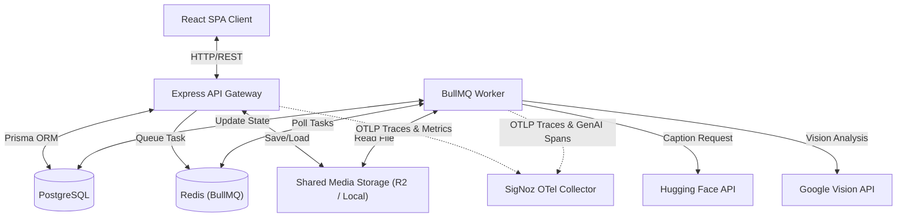
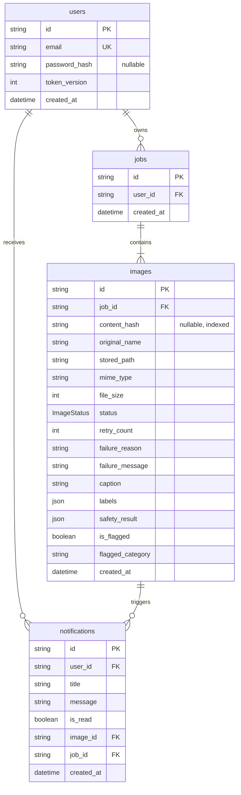
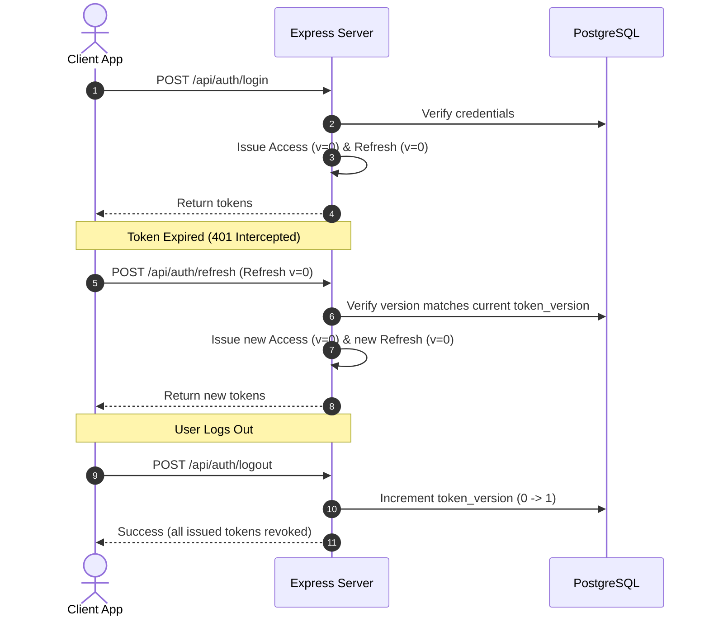
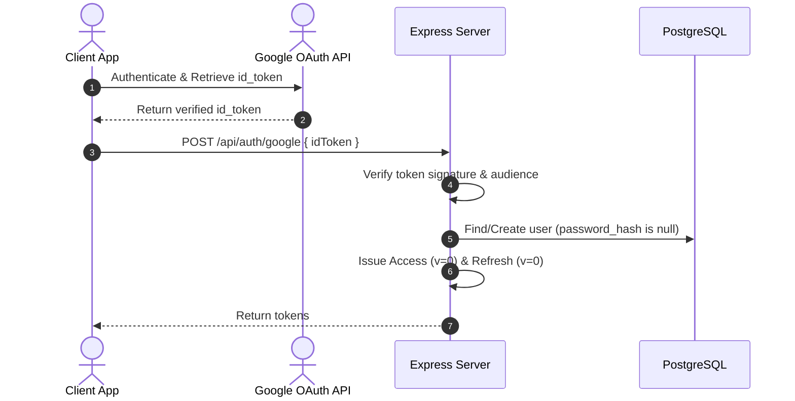

# AMPM: Architecture Documentation

This document defines the architecture of the **AMPM** (AI-Powered Media Processing Microservice).

---

## 1. High-Level Architecture Overview



---

## 2. Directory Layout & Package Breakdown

The codebase consists of three main packages:

- **[/client](file:///E:/AMPM/client)**: React (Vite) single-page application.
- **[/server](file:///E:/AMPM/server)**: Express REST API handling authentication, file storage, job records, duplicate detection, security middleware, and user notifications.
- **[/worker](file:///E:/AMPM/worker)**: Node.js service executing the asynchronous AI image pipeline with OpenTelemetry GenAI span tracking.

---

## 3. Database Schema Design

The relational schema is managed via Prisma in [schema.prisma](file:///E:/AMPM/server/prisma/schema.prisma).



- **Content Hash Index**: `content_hash` stores the SHA-256 digest of the uploaded image buffer. An index on `content_hash` enables $O(1)$ duplicate detection per user.
- **Dynamic Job Status**: Job status is calculated dynamically at runtime by checking the status of its child `Image` records (not stored in the database).
- **Token Versioning**: `token_version` on the `User` model is used to invalidate all active refresh tokens on logout.

---

## 4. Authentication & Security Model

Auth supports local email/password credentials and native Google OAuth (Google Sign-In), backed by a secure access/refresh token model with Refresh Token Rotation (RTR).

### Security & Hardening Layer

- **Helmet HTTP Headers**: Enforces Strict-Transport-Security (HSTS), Content-Security-Policy (CSP), and X-Content-Type-Options headers across all responses.
- **XSS Payload Sanitization**: Global Express middleware (`middleware/sanitize.ts`) strips recursive XSS injection attempts from request body, query parameters, and URL path parameters.
- **UUID Validation Middleware**: Path parameters (`:jobId`, `:imageId`, `:id`) are strictly validated against standard UUID format regex before handler execution.
- **Payload Limits & Filename Sanitization**: Body parser capped at 1MB (`express.json({ limit: "1mb" })`). Uploaded filenames are sanitized (`helpers/sanitize-filename.ts`) to prevent path traversal and XSS.
- **Rate Limiting**: Protected and auth endpoints enforce `express-rate-limit` per IP / authenticated user ID:
  - **Signup Endpoint** (`POST /api/auth/signup`): 3 requests per 60 minutes.
  - **Login Endpoint** (`POST /api/auth/login`): 5 requests per 15 minutes.
  - **Google Auth Endpoint** (`POST /api/auth/google`): 10 requests per 15 minutes.
  - **Token Refresh Endpoint** (`POST /api/auth/refresh`): 10 requests per 15 minutes.
  - **Upload Endpoint** (`POST /api/jobs`): 10 requests per 15 minutes.
  - **Retry Endpoints** (`POST /api/jobs/.../retry`): 20 requests per 15 minutes.
  - **Global Fallback**: 200 requests per 15 minutes across all API routes.

### Local Authentication Flow



### Google OAuth Flow



---

## 5. Job Upload, Deduplication & Atomic Enqueueing

When uploading a batch of $N$ images:

1. **Validation & Hashing**: Multer validates file types (JPEG, PNG, WEBP) and size (limit: 5MB per file). The API computes a SHA-256 digest (`content_hash`) for each file buffer.
2. **Duplicate Lookup**: The API queries `images` for an existing completed image belonging to the user with the same `content_hash`. If found, metadata (`caption`, `labels`, `safety_result`, `is_flagged`) is copied into the new record with `COMPLETED` status immediately, skipping Redis queueing.
3. **Transaction & Concurrent Race Prevention**: A Prisma transaction creates a `Job` record and related `Image` records. Inside the transaction, existing completed images are re-queried to handle concurrent duplicate upload race conditions. If an image is identified as a duplicate during transaction execution, any orphaned Cloudflare R2 uploads generated by the race condition loser are cleaned up immediately.
4. **Queueing & Rollback Safety**: Only new `PENDING` images are enqueued to BullMQ in Redis. If queue insertion fails, the database transaction rolls back, preventing orphaned records.

---

## 6. Worker Pipeline

The worker polls BullMQ tasks and runs each image through the safety-first pipeline:

```mermaid
flowchart TD
    Start([Task Received]) --> Proc[Mark Status: PROCESSING]
    Proc --> Sharp[Read & Validate Image via Sharp]

    subgraph AI Pipeline
        Sharp --> Safe[1. Google Vision SafeSearch]
        Safe --> SafetyCheck{SafeSearch Flagged?}
        SafetyCheck -->|No| Label[2. Google Vision Labels]
        Label --> Caption[3. Hugging Face BLIP Captioning]
        SafetyCheck -->|Yes| Flag[Set isFlagged: true & Category — skip labels & caption]
    end

    Flag --> Notif[Create User Notification in DB]
    Notif --> Save[Save safety result to DB]
    Caption --> Save

    Save --> Comp[Mark Status: COMPLETED]
    Comp --> Done([Task Completed])

    AI Pipeline -.->|Pipeline Failure| Err[Categorize Error Retryability]
    Err --> RetryCheck{Retryable?}

    RetryCheck -->|No| Fail[Mark Status: FAILED]
    Fail --> Discard[Discard Task]
    Discard --> EndErr([Task Discarded])

    RetryCheck -->|Yes| AttemptCheck{Attempts Remaining?}
    AttemptCheck -->|Yes| Resubmit[Increment retry_count & Set PENDING]
    Resubmit --> FailQueue([Fail Task for Redis Retry])

    AttemptCheck -->|No| FinalFail[Mark Status: FAILED with MAX_RETRIES_EXCEEDED]
    FinalFail --> EndErr
```

### Safety-First Execution Order

- **Google Vision SafeSearch** runs first. On a safe result, **Label Detection** then **Hugging Face BLIP captioning** run next.
- If SafeSearch detects unsafe content (`LIKELY` or `VERY_LIKELY`), the pipeline stops immediately: label detection and captioning are both skipped to save AI compute/quota, results are saved with an empty label set and null caption, the image is flagged, and an in-app notification is dispatched.

### Resilient Networking & Error Classification

- **DNS Warm-Up**: Hugging Face API requests feature best-effort public DNS pre-resolution to absorb transient resolver lookup drops (`ENOTFOUND`).
- **Classification Rules**:
  - **Non-Retryable Errors** (`INVALID_FILE`, `UNSUPPORTED_FORMAT`, `FILE_TOO_LARGE`): Marked `FAILED`, discarded via `job.discard()`.
  - **Retryable Errors** (`AI_PROVIDER_TIMEOUT`, `AI_PROVIDER_RATE_LIMITED`, `AI_PROVIDER_UNAUTHORIZED`, `GOOGLE_VISION_API_ERROR`, `NETWORK_ERROR`, `INTERNAL_ERROR`): Database status reset to `PENDING`, `retry_count` incremented, BullMQ retries with exponential backoff.

---

## 7. Observability & Queue Depth Metrics

The system exports OpenTelemetry traces, AI model token metrics, and queue depth telemetry to SigNoz:

- **Queue Depth Metrics Poller** (`server/src/queue-metrics.ts`): Registers an `ampm.queue.depth` UpDownCounter instrument. When enabled via `QUEUE_DEPTH_METRICS_ENABLED=true`, it periodically polls BullMQ (`imageQueue.getJobCounts()`) at a configurable interval (`QUEUE_DEPTH_POLL_INTERVAL_MS`, default: 10,000ms) to report backlog (`waiting`), in-flight (`active`), and retry-backoff (`delayed`) job counts.
- **Server Lifecycle Integration**: Started automatically during server startup after OpenTelemetry initialization and cleared on `SIGTERM`/`SIGINT` signals for graceful shutdown.
- **AI Token Tracking**: Captures input and output token consumption for Hugging Face BLIP inference via GenAI span attributes (`gen_ai.usage.input_tokens`, `gen_ai.usage.output_tokens`).
